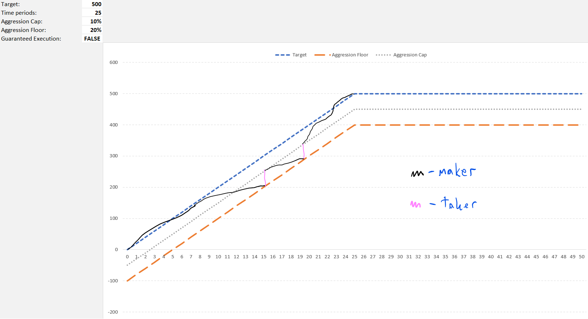
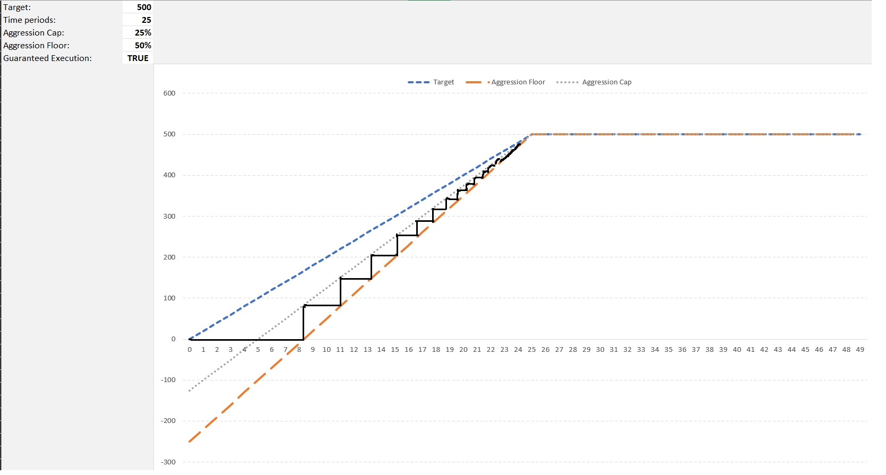

# http_nt_pclient
# Nickel Trader TWAP algorithm for NT users.
## Limits    This REST API has a global limit per user of **20 requests per minute**. HTTP 429 status is returned when user exceeds the limit and should be handled by the client.
Each API response contains `X-Rate-Limit-Remaining` header allowing users to plan requests accordingly.
## High-level explanation
### TWAP is designed with the following goals in mind:
- Guarantee execution of the exact size within the specified window.
- Minimize market impact vs a theoretical TWAP.
- Minimize risk of detection through randomisation of its behaviour.
- Minimize taker transaction costs.
## Parameters of TWAP execution in NT:
- `site` - Instance of Nickel Trader used for the execution. One or more can be available.
- `executionId` - Unique identifier for the strategy, generated by the user. Limited to 8 characters. Creating a strategy with the same identifier twice leads to the replacement of the existing strategy.
- `instrument` - Instrument to trade, following symbol@exchange convention.
- `account` - Account to trade.
- `side` - Side to trade: can be buy or sell.
- `target` - Full quantity of the base asset to trade. The strategy will stop when target is reached. Only settable for an existing strategy in state NEW or STOPPED. Cannot be set together with `targetPosition`.
- `targetPosition` - Signed position size following successful execution of the trading algorithm. Only settable for an existing strategy in state NEW or STOPPED. Cannot be set together with `target`.
- `stepSize` - The average increment of each step of TWAP execution (subject to randomisation).
- `stepTime` - The average time delay in seconds between each step of TWAP execution (subject to randomisation).
- `aggressionFloor` - Distance from the current step's target when aggressive execution takes over. Expressed in percentage points of the full quantity target. Used in conjunction with `aggressionCap`, and should be set close to `aggressionCap` to avoid large taker orders when passive execution is lagging behind the current step's target. Must be within [0,100] or, most strictly, [`aggressionCap`, 100]. Set to 0 for taker-only execution. Set to 100 for maker-only execution.
- `aggressionCap` - Distance from the current step's target when aggressive execution stops and passive execution continues. Expressed in percentage points of the full quantity target. Used in conjunction with `aggressionFloor`. Must be within [0,100] or, most strictly, [0, `aggressionFloor`]. Set to 0 for aggressive execution all the way to the current step's target. Set close to `aggressionFloor` for minimal but frequent taker execution. Settable for an existing strategy in all states.
- `scheduledStartTime` - TWAP will start automatically at given start time.
- `scheduledStopTime` - TWAP will stop automatically at given stop time.
- `guaranteedExecution` - Ensure complete execution within scheduled execution period by executing more taker orders towards the end of the execution window (TRUE), or continue to quote the final slice until it's taken (FALSE).
- `start` - Start strategy execution immediately after submit.
### Parameter combination rules:  TWAP performs the execution in steps of `stepSize`, once every `stepTime` (both of these are randomised around the mean). For ease of below, let's define `numberOfSteps := target / stepSize`.
#### Start  TWAP starts when `start = true`, or when `scheduledStartTime` is reached. Set **at most one** of these parameters (you can set none to prepare the TWAP for a later manual start). **Setting both parameters will lead to a reject.**
#### Stop  TWAP stops when `target` is reached or when `scheduledStopTime` is reached, whichever is first.
#### `stepTime`
- If you provide `scheduledStopTime`, we automatically calculate `stepTime`, so **setting any value to `stepTime` in the request will lead to a reject**. We calculate it `as stepTime = (scheduledStopTime - startTime)/numberOfSteps`, where `startTime` is when the strategy is started.
- If no `scheduledStopTime` is provided, `stepTime` is required.
## Taker-only execution [`aggression floor = 0`]
- The most naïve implementation of TWAP, executing `(1/n)*target` every `stepTime` as a taker.
## Maker-only execution [`aggression floor = 100`]
- TWAP will attempt to execute everything as maker (by quoting on the most aggressive non-crossing level in the orderbook available). This, however, means that in the absence of takers in the market, it's possible the algo never gets any fills, or get a lot of the fills towards the end of the time window, resulting in bad execution vs. a theoretical TWAP.
## Maker execution with occasional taker execution [`aggression floor in (0,100), aggression cap in (0, aggression floor)`]
- To ensure poor taker-only execution doesn't happen, we introduce the `aggression floor` and the `aggression cap`. The parameters are explained above, and they act to ensure aggressive execution takes over, should the executed size fall too far behind the current target. Graphically, an example of looks like this (with the current position line in black when executing as a maker, in pink as a taker):

- The graph shows how the two parameters work:
- whenever the currently executed size dips below the `aggression floor` (orange line), taker orders are initiated
- TWAP returns to maker-execution when the currently executed size reaches the `aggression cap` (gray line)
# Guaranteed execution [`guaranteed execution = TRUE`]
- The taker logic outlined above does not guarantee the execution of the full `target` in the specified time. To see this, imagine a case where all the execution happens as a taker (in complete absence of the taker flow from the market):

- With this mechanism alone, we can only guarantee the `aggression floor` amount is executed, as it's only when the amount executed dips below it that we initiate taker orders.
- To ensure full execution in the specified time window, we add a `guaranteed execution` parameter (TRUE/FALSE), that adjusts the `aggression floor` and the `aggression cap` to ensure full amount gets executed by the end of the time window:

# Randomisation [always-on]
- The blue line on the graphs above indicates the non-stochastic target (which, in turn, would result in constant order size for each iteration). In reality, the TWAP algorithm randomises both the order size and the time between orders, doing so in a way that keeps the execution probabilistically very close to the blue line, but making it hard for market-makers to detect and widen their quotes.

- API version: 1.0.0
- Package version: 1.0.0
- Build package: io.swagger.codegen.v3.generators.python.PythonClientCodegen

## Requirements.

Python 3.10+

## Installation & Usage
### pip install

```sh
pip install http-nt-pclient
```

Then import the package:
```python
import http_nt_pclient
```

## Getting Started

Please follow the [installation procedure](#installation--usage) and then run the following:

```python
import asyncio
import http_nt_pclient
from http_nt_pclient.rest import ApiException
from pprint import pprint

async def main():
    """
    Example of using GeneralApi endpoints with clean session management.

    Demonstrates:
    - Configuring the client
    - Querying sites, exchanges, exposures, instruments, and limits
    - Using a single try/finally to ensure session cleanup
    """

    # Configure HTTP basic authorization: basicAuth
    api_instance = http_nt_pclient.GeneralApi()
    api_instance.api_client.configuration.username = 'API_KEY'
    api_instance.api_client.configuration.password = 'API_SECRET'
    api_instance.api_client.configuration.host = 'TRADER_URL'

    # Parameters
    site = 'SITE_NAME'  # Instance of Nickel Trader used for execution
    account_id = 'ACCOUNT_ID'  # Exchange account identifier in Nickel Trader
    exchange = 'EXCHANGE_NAME'  # Exchange code (e.g. 'BINANCE_FUTURES_USDT')

    try:
        # Sites
        print('Available sites:')
        api_response = await api_instance.sites()
        pprint(api_response)

        # Exchanges
        print('Available exchanges:')
        api_response = await api_instance.exchanges(site)
        pprint(api_response)

        # Exposures for account
        print('Exposures for account:')
        api_response = await api_instance.exposures_for_account(account_id)
        pprint(api_response)

        # Exposures (all)
        print('Exposures (all):')
        api_response = await api_instance.exposures()
        pprint(api_response)

        # Instruments
        print('Instruments:')
        api_response = await api_instance.instruments(site, exchange)
        pprint(api_response)

        # Limits
        print('Limits:')
        api_response = await api_instance.limits(site, exchange, account_id)
        pprint(api_response)

    except ApiException as e:
        print(f"API Exception: {e}")
        raise e

    finally:
        # Explicitly close the session
        await api_instance.api_client.rest_client.pool_manager.close()

if __name__ == '__main__':
    asyncio.run(main())
```

### How to TWAP
```python
import http_nt_pclient
from http_nt_pclient.rest import ApiException
import asyncio
import datetime
from pprint import pprint


async def main():
    """
    Complete example demonstrating TWAP strategy lifecycle management.
    
    This example shows how to:
    - Configure API clients with shared credentials
    - Query existing strategies
    - Create, update, and delete single strategies
    - Create, update, and delete multiple strategies in batch
    - Properly manage async session cleanup
    """
    # Configuration
    api_config = {
        'username': 'API_KEY',
        'password': 'API_SECRET',
        'host': 'TRADER_URL'
    }
    
    # Initialize API instances with shared configuration
    twap_api_instance = http_nt_pclient.TWAPApi()
    strategy_api_instance = http_nt_pclient.StrategyApi()
    
    # Apply configuration to both instances
    for api_instance in [twap_api_instance, strategy_api_instance]:
        api_instance.api_client.configuration.username = api_config['username']
        api_instance.api_client.configuration.password = api_config['password']
        api_instance.api_client.configuration.host = api_config['host']
    
    # Trading parameters
    site = 'SITE_NAME'  # Instance of Nickel Trader used for execution
    instrument = 'INSTRUMENT_NAME'  # Trading instrument (e.g. 'BTCUSDT@BINANCE_FUTURES_USDT')
    account_id = 'ACCOUNT_ID'  # Exchange account identifier in Nickel Trader

    try:
        # Query existing TWAP strategies
        api_response = await twap_api_instance.twap_strategies()
        print("Existing TWAP strategies:")
        pprint(api_response)
        
        # === SINGLE STRATEGY LIFECYCLE ===
        
        # Create a single TWAP strategy
        params = http_nt_pclient.TwapParameters(
            instrument=instrument,
            account=account_id,
            side='BUY',
            target=0.1,
            guaranteed_execution='NO',
            scheduled_start_time=datetime.datetime.now(tz=datetime.timezone.utc) + datetime.timedelta(minutes=60),
            aggression_cap=0.3,
            aggression_floor=0.5,
            step_size=0.01,
            step_time=1
        )

        api_response = await twap_api_instance.create(params, site, 'excID1')
        print("Created single TWAP strategy:")
        pprint(api_response)

        # Update the strategy
        update_params = http_nt_pclient.TwapUpdateParameters(
            limit_price=10000,
        )

        api_response = await twap_api_instance.update(update_params, site, 'excID1')
        print("Updated single TWAP strategy:")
        pprint(api_response)

        # Delete the strategy
        api_response = await strategy_api_instance.delete(site, 'excID1')
        print("Deleted single TWAP strategy:")
        pprint(api_response)

        # === MULTIPLE STRATEGIES LIFECYCLE ===
        
        # Create multiple strategies in a single request
        multi_params = http_nt_pclient.MultipleTwapParameters(twaps=[
            http_nt_pclient.TwapParametersWithId(
                execution_id='excID2',  # Must be unique across all strategies
                parameters=http_nt_pclient.TwapParameters(
                    instrument=instrument,
                    account=account_id,
                    side='SELL',
                    target=0.1,
                    guaranteed_execution='YES',
                    scheduled_start_time=datetime.datetime.now(tz=datetime.timezone.utc) + datetime.timedelta(minutes=60),
                    aggression_cap=0.9,
                    aggression_floor=0.95,
                    step_size=0.01,
                    step_time=1
                )
            ),
            http_nt_pclient.TwapParametersWithId(
                execution_id='excID3',  # Must be unique across all strategies
                parameters=http_nt_pclient.TwapParameters(
                    instrument=instrument,
                    account=account_id,
                    side='BUY',
                    target=0.1,
                    guaranteed_execution='NO',
                    scheduled_start_time=datetime.datetime.now(tz=datetime.timezone.utc) + datetime.timedelta(minutes=60),
                    aggression_cap=0.3,
                    aggression_floor=0.5,
                    step_size=0.01,
                    step_time=1
                )
            )
        ])

        api_response = await twap_api_instance.create_multi(multi_params, site)
        print("Created multiple TWAP strategies:")
        pprint(api_response)

        # Update multiple strategies
        multi_update = http_nt_pclient.MultipleTwapUpdateParameters(updates=[
            http_nt_pclient.TwapUpdateParametersWithId(
                execution_id='excID2',
                parameters_to_update=http_nt_pclient.TwapUpdateParameters(limit_price=100000)
            ),
            http_nt_pclient.TwapUpdateParametersWithId(
                execution_id='excID3',
                parameters_to_update=http_nt_pclient.TwapUpdateParameters(target=0.5)
            )
        ])

        api_response = await twap_api_instance.update_multi(multi_update, site)
        print("Updated multiple TWAP strategies:")
        pprint(api_response)

        # Delete multiple strategies
        delete_ids = http_nt_pclient.ExecutionIds(execution_ids=['excID2', 'excID3'])
        api_response = await strategy_api_instance.delete_multi(delete_ids, site)
        print("Deleted multiple TWAP strategies:")
        pprint(api_response)

    except ApiException as e:
        print(f"API Exception: {e}")
        raise e

    finally:
        # CRITICAL: Always close API client sessions to prevent resource leaks
        await twap_api_instance.api_client.rest_client.pool_manager.close()
        await strategy_api_instance.api_client.rest_client.pool_manager.close()


if __name__ == '__main__':
    asyncio.run(main())
```

## Documentation for API Endpoints

All URIs are relative to *NT_URL*

Class | Method | HTTP request | Description
------------ | ------------- | ------------- | -------------
*GeneralApi* | [**exchanges**](docs/GeneralApi.md#exchanges) | **GET** /v1/exchanges/{site} | Returns list of available exchanges
*GeneralApi* | [**exposures**](docs/GeneralApi.md#exposures) | **GET** /v1/exposures | Returns a list of the exposures
*GeneralApi* | [**exposures_for_account**](docs/GeneralApi.md#exposures_for_account) | **GET** /v1/exposures/{accountId} | Returns a list of the exposures
*GeneralApi* | [**instruments**](docs/GeneralApi.md#instruments) | **GET** /v1/instruments/{site}/{exchange} | Returns list of available instruments
*GeneralApi* | [**limits**](docs/GeneralApi.md#limits) | **GET** /v1/limits/{site}/{exchange}/{accountId} | Returns user limits
*GeneralApi* | [**sites**](docs/GeneralApi.md#sites) | **GET** /v1/sites | Returns list of available Nickel Trader instances (sites)
*StrategyApi* | [**change_state**](docs/StrategyApi.md#change_state) | **POST** /v1/strategy/{site}/{executionId} | start/stop/pause/resume strategy
*StrategyApi* | [**change_state_multi**](docs/StrategyApi.md#change_state_multi) | **POST** /v1/strategy/{site} | start/stop/pause/resume multiple strategies
*StrategyApi* | [**delete**](docs/StrategyApi.md#delete) | **DELETE** /v1/strategy/{site}/{executionId} | Delete strategy
*StrategyApi* | [**delete_multi**](docs/StrategyApi.md#delete_multi) | **DELETE** /v1/strategy/{site} | Delete strategies
*StrategyApi* | [**strategies**](docs/StrategyApi.md#strategies) | **GET** /v1/strategy/{site} | Returns list of user strategies
*StrategyApi* | [**strategy**](docs/StrategyApi.md#strategy) | **GET** /v1/strategy/{site}/{executionId} | Returns strategy
*TWAPApi* | [**create**](docs/TWAPApi.md#create) | **POST** /v1/strategy/twap/{site}/{executionId} | Create twap strategy instance
*TWAPApi* | [**create_multi**](docs/TWAPApi.md#create_multi) | **POST** /v1/strategy/twap/{site} | Create multiple twap strategies
*TWAPApi* | [**replace**](docs/TWAPApi.md#replace) | **PUT** /v1/strategy/twap/{site}/{executionId} | Replace twap strategy instance
*TWAPApi* | [**replace_multi**](docs/TWAPApi.md#replace_multi) | **PUT** /v1/strategy/twap/{site} | Replace multiple twap strategies
*TWAPApi* | [**twap_strategies**](docs/TWAPApi.md#twap_strategies) | **GET** /v1/strategy/twap | Returns list of user strategies
*TWAPApi* | [**twap_strategies_for_site**](docs/TWAPApi.md#twap_strategies_for_site) | **GET** /v1/strategy/twap/{site} | Returns list of user strategies
*TWAPApi* | [**twap_strategy**](docs/TWAPApi.md#twap_strategy) | **GET** /v1/strategy/twap/{site}/{executionId} | Return TWAP strategy
*TWAPApi* | [**update**](docs/TWAPApi.md#update) | **PATCH** /v1/strategy/twap/{site}/{executionId} | Update existing TWAP strategy parameters. Updates only fields provided in request body
*TWAPApi* | [**update_multi**](docs/TWAPApi.md#update_multi) | **PATCH** /v1/strategy/twap/{site} | Update existing multiple TWAP strategy parameters. Updates only fields provided in request body

## Documentation For Models

 - [ApiError](docs/ApiError.md)
 - [ExecutionId](docs/ExecutionId.md)
 - [ExecutionIds](docs/ExecutionIds.md)
 - [ExposureDTO](docs/ExposureDTO.md)
 - [InstrumentQuantitiesDefinition](docs/InstrumentQuantitiesDefinition.md)
 - [InstrumentSpecification](docs/InstrumentSpecification.md)
 - [Issue](docs/Issue.md)
 - [LimitBreachedInfo](docs/LimitBreachedInfo.md)
 - [LimitResponse](docs/LimitResponse.md)
 - [MultipleStrategiesActionRequest](docs/MultipleStrategiesActionRequest.md)
 - [MultipleTwapParameters](docs/MultipleTwapParameters.md)
 - [MultipleTwapUpdateParameters](docs/MultipleTwapUpdateParameters.md)
 - [RequestedAction](docs/RequestedAction.md)
 - [Response](docs/Response.md)
 - [Sites](docs/Sites.md)
 - [Strategies](docs/Strategies.md)
 - [StrategyState](docs/StrategyState.md)
 - [Twap](docs/Twap.md)
 - [TwapCreateControllerResponse](docs/TwapCreateControllerResponse.md)
 - [TwapParameters](docs/TwapParameters.md)
 - [TwapParametersWithId](docs/TwapParametersWithId.md)
 - [TwapParametersWithIdAndStatistics](docs/TwapParametersWithIdAndStatistics.md)
 - [TwapParametersWithStatistics](docs/TwapParametersWithStatistics.md)
 - [TwapReplace](docs/TwapReplace.md)
 - [TwapReplaceControllerResponse](docs/TwapReplaceControllerResponse.md)
 - [TwapReplaceResponse](docs/TwapReplaceResponse.md)
 - [TwapStatistics](docs/TwapStatistics.md)
 - [TwapUpdateControllerResponse](docs/TwapUpdateControllerResponse.md)
 - [TwapUpdateParameters](docs/TwapUpdateParameters.md)
 - [TwapUpdateParametersWithId](docs/TwapUpdateParametersWithId.md)
 - [TwapWithStatistics](docs/TwapWithStatistics.md)


